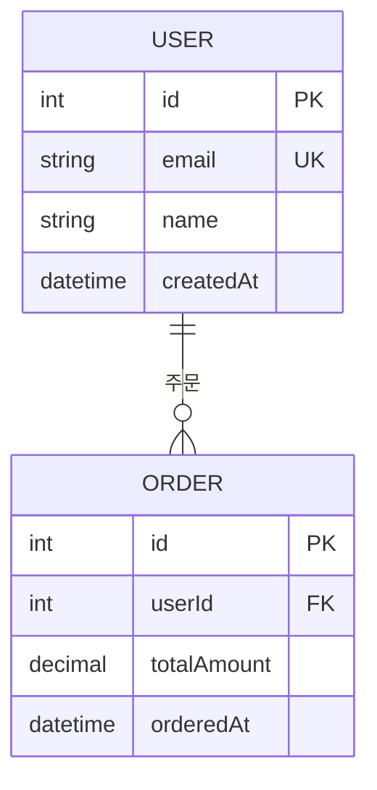

# AI-DLC 데이터 모델 분석

ORM 엔터티·스키마 파일, SQL DDL, 마이그레이션 파일을 분석하여 엔터티 목록·관계·ERD 텍스트 다이어그램을 포함한 **데이터 모델 분석서**를 산출한다.

공통 출력 정책: `${CLAUDE_SKILL_DIR}/../ai-dlc-common/references/output-policy.md` 참조.

## 트리거

- "데이터 모델 분석", "ERD 만들어줘", "테이블 관계 분석", "엔터티 분석"
- "DB 스키마 분석", "데이터베이스 구조 분석", "엔터티 관계도"
- "테이블 설계 분석", "ORM 모델 분석해줘", "Prisma 스키마 분석"
- 소스코드 경로를 주며 "데이터 모델 보여줘"라고 할 때

## 입력

- **필수**: 분석 대상 경로 (디렉터리 또는 ORM 파일)
- **선택**: 시스템명, DB 종류 (MySQL/PostgreSQL/MongoDB 등)

## 분석 절차

1. **모델 파일 탐지**: `Glob`으로 ORM·스키마 파일 탐지
   - TypeORM: `*.entity.ts`, `*Entity.ts`
   - Prisma: `schema.prisma`
   - SQLAlchemy: `models.py`, `*model*.py`
   - JPA: `@Entity` 포함 `.java` 파일
   - Mongoose: `*.schema.ts`, `*Schema.js`
   - SQL DDL: `*.sql`, `migrations/*.sql`
2. **엔터티 추출**: 각 ORM 패턴으로 `Grep` + `Read`
   - 엔터티명, 테이블명, 필드명·타입·제약조건 (PK, FK, UNIQUE, NOT NULL)
3. **관계 추출**:
   - 1:1 (`@OneToOne`, `hasOne`)
   - 1:N (`@OneToMany`, `@ManyToOne`, `hasMany`, `belongsTo`)
   - N:M (`@ManyToMany`, `belongsToMany`, Junction table)
   - FK 컬럼명 추출
4. **누락·불명확 항목 식별**: 관계가 선언되었으나 대상 엔터티 파일 없음, FK는 있으나 관계 어노테이션 없음
5. **ERD 생성**: Mermaid `erDiagram` 문법으로 텍스트 다이어그램 출력

## 산출물 포맷

파일명: `데이터모델분석_{시스템명}_{YYYYMMDD}.md`

`${CLAUDE_SKILL_DIR}/template.md` 골격 사용:

1. **엔터티 목록** (엔터티명·테이블명·주요 속성)
2. **관계 정의** (관계 유형·FK·조인 컬럼)
3. **ERD (Mermaid erDiagram)**
4. **누락/불명확 항목**

## ORM별 탐지 패턴

| ORM/도구 | 탐지 파일 | 핵심 패턴 |
|:---|:---|:---|
| TypeORM | `*.entity.ts` | `@Entity(`, `@Column(`, `@PrimaryGeneratedColumn` |
| Prisma | `schema.prisma` | `model `, `@@map(`, `@relation(` |
| SQLAlchemy | `models.py` | `class.*Base`, `Column(`, `ForeignKey(` |
| JPA | `*.java` | `@Entity`, `@Table`, `@Column`, `@ManyToOne` |
| Mongoose | `*.schema.ts` | `new Schema(`, `type:`, `ref:` |
| SQL DDL | `*.sql` | `CREATE TABLE`, `FOREIGN KEY`, `REFERENCES` |

## Mermaid ERD 예시

## 작성 원칙

- `node_modules`, `.git`, `dist`, `build`, `__pycache__`, `migrations` 제외 (단, DDL 마이그레이션은 포함)
- 엔터티 수가 30개 이상이면 핵심 엔터티(참조 많은 순) 우선 표시 + 전체 목록은 부록
- 누락·불명확 항목에 `<!-- TODO: 확인 필요 -->` 표시
- NoSQL(MongoDB)은 컬렉션·필드 구조로 대체 표현

## 엣지 케이스

- **Raw SQL만 사용**: DDL 파싱으로 엔터티 추출
- **다중 DB 혼재**: DB별 섹션 분리
- **MongoDB 스키마리스**: 실제 데이터 파일이 없으면 Mongoose 스키마로만 분석하고 한계 명기
- **View, Stored Procedure**: 별도 섹션으로 분리 표시
